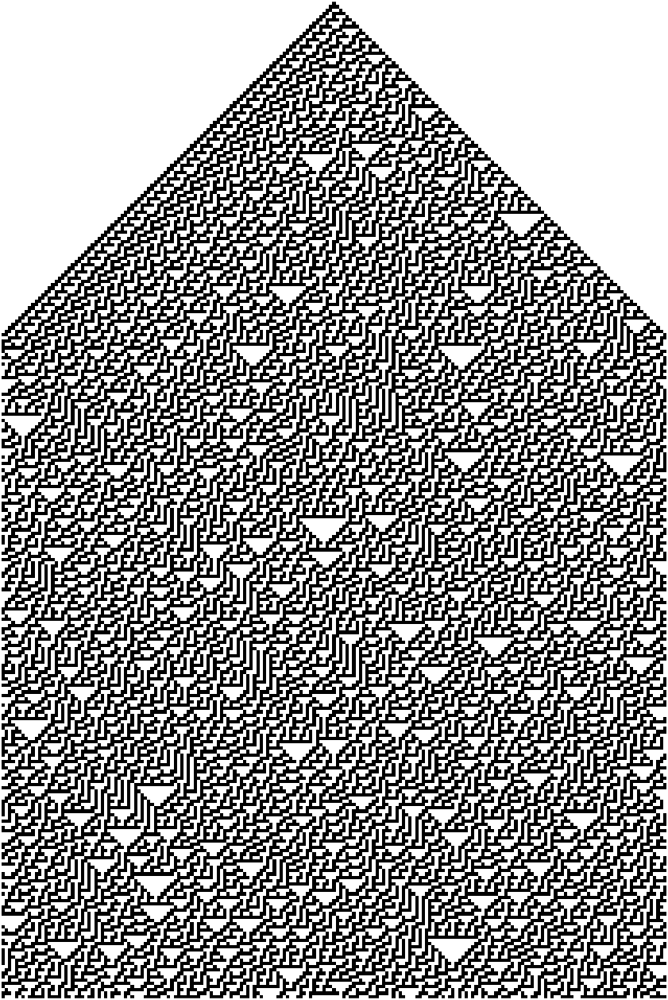

# rand-eca

Random uniform using elementary cellular automata in matlab.

- [x] rule 30 function that given state produces next state
- [x] run the rule for x interations and visualize outputs
- [x] convert middle bits into numbers
- [x] function(seed, rule, width, num_bits, num_numbers) -> decimal list (potentially)
- [x] sampling strategy
- [x] visualize histogram
- [ ] statistical tests versus uniform dist or metrics
	- [x] function that takes bins within [0, 1.0] and counts the occurences within the bins
	- [x] compute mse versus true uniform and our numbers
	- [x] compute $\chi^2$ for my function and the built in
- [x] write outline for report
- [x] do the transform to any other pdf
- [x] Create figure describing ECA
- [x] Create sampling strategy figure
- [x] Write out the ECA visulize in report
- [x] Write out the rand\_eca in the report 
- [ ] Write out the statistical tests
- [ ] Create figure for the statistical tests
- [ ] Write implementation on the transform to any other pdf
- [ ] Create figure showing conversion to other pdfs
