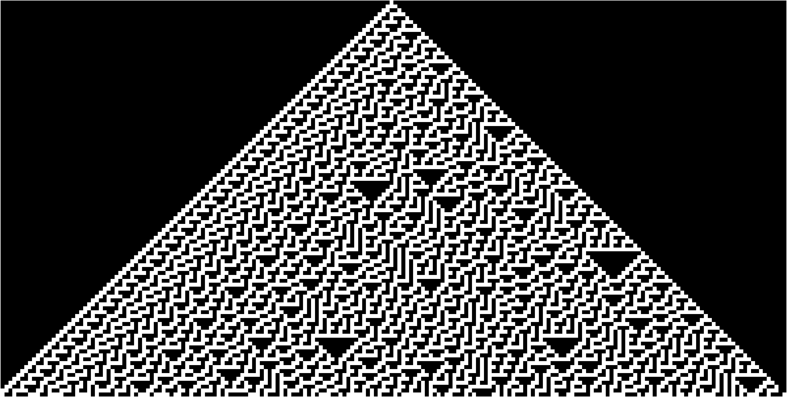

# rand-eca

Random uniform using elementary cellular automata in matlab.

- [x] rule 30 function that given state produces next state
- [x] run the rule for x interations and visualize outputs
- [x] convert middle bits into numbers
- [x] function(seed, rule, width, num_bits, num_numbers) -> decimal list (potentially)
- [x] sampling strategy
- [x] visualize histogram
- [ ] statistical tests versus uniform dist or metrics
- [ ] seed strategy

## Sampling Strategy

- Given a seed radius (padding around the middle bit on both sides)
- Given timesteps (8 for 8 bit number)
- Given numbers to sample as $n$

seed -> 00000000100000000 has seed radius 9 (since 9 zeros on each side of middle number)
Run for 8 iterations, I take the middle column and convert to decimal binary.

## References

- https://mathworld.wolfram.com/Rule30.html
- https://demonstrations.wolfram.com/UsingRule30ToGeneratePseudorandomRealNumbers/#more
